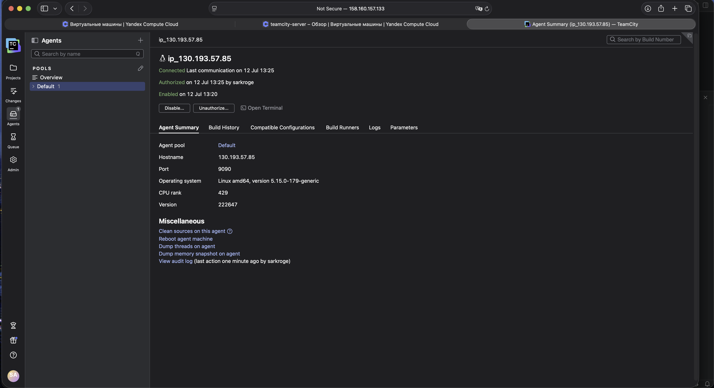
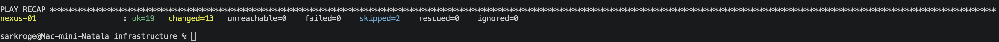
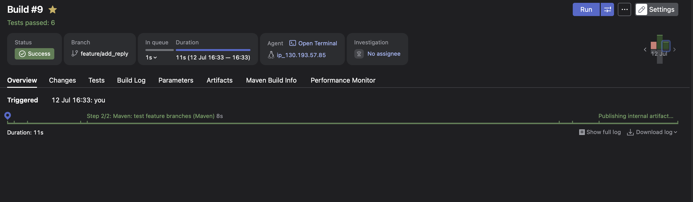
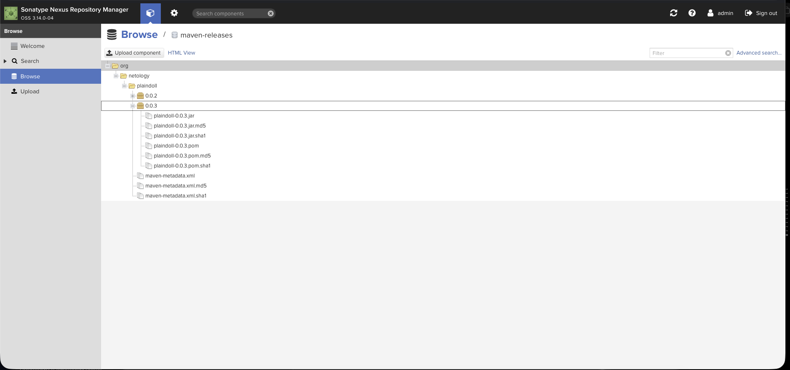
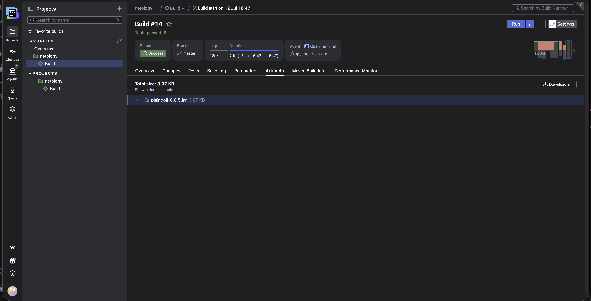

# Домашнее задание к занятию «TeamCity»
Краснов Егор

## Выполненные работы

В рамках домашнего задания были выполнены следующие действия:

1. Развёрнут сервер TeamCity в Yandex Cloud.
2. Развёрнут и авторизован TeamCity Agent.
3. Развёрнут Nexus Repository Manager.
4. Создан форк учебного репозитория `example-teamcity`.
5. В TeamCity создан проект `netology` и конфигурация сборки `Build`.
6. Подключён VCS Root к репозиторию GitHub.
7. Настроена работа с ветками `master` и `feature/add_reply`.
8. Настроен VCS Trigger для автоматического запуска сборок.
9. Настроены два шага Maven:
   - `clean deploy` для ветки `master`;
   - `clean test` для feature-веток.
10. Настроена публикация Maven-артефактов в Nexus.
11. Добавлен новый метод `sayReply()` и тест `welcomerSaysReply()`.
12. Feature-ветка успешно протестирована: выполнено 6 тестов.
13. Изменения объединены с веткой `master`.
14. Версия проекта увеличена для публикации нового release-артефакта.
15. Настроена публикация JAR-файла в артефакты TeamCity.
16. Конфигурация TeamCity сохранена в репозитории в формате Kotlin DSL.

## Настройка TeamCity Agent

TeamCity Agent был подключён к серверу и авторизован в интерфейсе TeamCity.





## Установка Nexus

Nexus Repository Manager был установлен на отдельной виртуальной машине с помощью Ansible.





## Настройка проекта TeamCity

VCS Root:

```text
https://github.com/sarkroge/example-teamcity.git
```

Настройки веток:

```text
Default branch:
refs/heads/master

Branch specification:
+:refs/heads/*
```

## Логика сборки

Для ветки `master`:

```text
Maven: deploy master
Goals: clean deploy
Condition: teamcity.build.branch equals master
```

Для остальных веток:

```text
Maven: test feature branches
Goals: clean test
Condition: teamcity.build.branch does not equal master
```

## Сборка feature-ветки

Была создана ветка:

```text
feature/add_reply
```

В класс `Welcomer` добавлен метод:

```java
public String sayReply() {
    return "The hunter never walks alone.";
}
```

Для метода добавлен тест:

```java
@Test
public void welcomerSaysReply() {
    assertThat(welcomer.sayReply(), containsString("hunter"));
}
```

Результат:

```text
Tests run: 6
Failures: 0
Errors: 0
Skipped: 0
BUILD SUCCESS
```





## Merge в master

После успешного тестирования был создан Pull Request из `feature/add_reply` в `master`, после чего изменения были объединены.

## Публикация в Nexus

Использован репозиторий:

```text
maven-releases
```

Координаты артефакта:

```text
GroupId: org.netology
ArtifactId: plaindoll
Version: 0.0.5
```




## Артефакты TeamCity

Правило публикации:

```text
target/plaindoll-*.jar
```

Пример опубликованного файла:

```text
plaindoll-0.0.5.jar
```





## Kotlin DSL

Настройки TeamCity сохранены в каталоге:

```text
.teamcity
```

Проверка:

```bash
find .teamcity -maxdepth 3 -type f | sort
grep -R "artifactRules" .teamcity
```

Ожидаемое правило:

```kotlin
artifactRules = "target/plaindoll-*.jar"
```

## Итог

Настроен CI-процесс:

1. Изменения в feature-ветках запускают тестирование.
2. Ветка `master` выполняет тестирование, сборку и публикацию release-артефакта в Nexus.
3. JAR-файл сохраняется в артефактах TeamCity.
4. Конфигурация TeamCity хранится в репозитории в формате Kotlin DSL.
